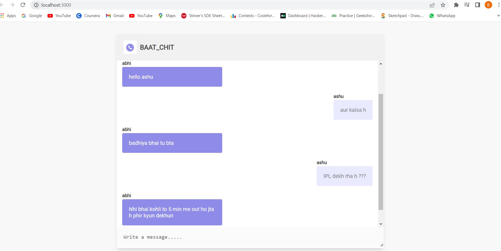

# Real_time_chat

Realtime chat app using socket.io and vanilla JavaScript
## Screenshots

    

## Install all dependencies 
After download or clone run `npm install` to install all the dependancies like express,nodemon(dev dependent)
### `npm install express`
### `npm install nodemon -D`
### `npm install socket.io`

In the project directory, you can run:
### `npm run dev`
Runs the app in the development mode.\
Open [http://localhost:3000](http://localhost:3000) to view it in your browser.

